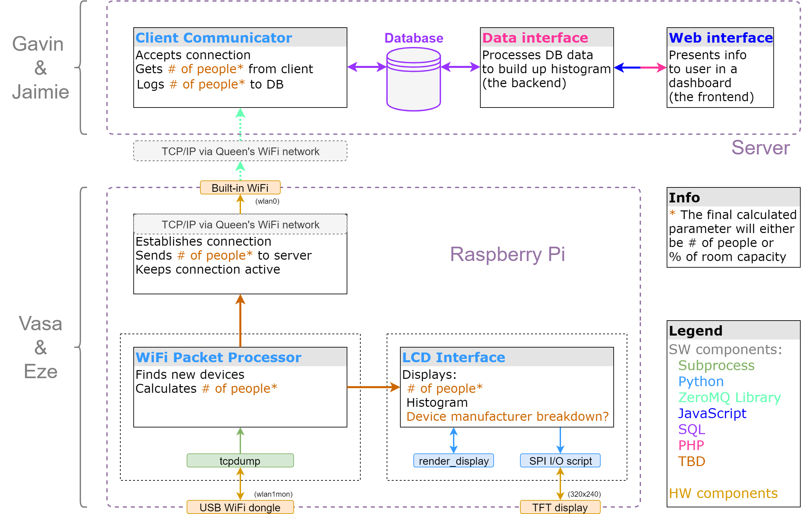

# Wi-Wait Capstone Project
## Team 2

## Architecture

## File structure
### Server
- Files that go on the web server for serving web interface and DB integration

### RPi
- Files that go on the Raspberry Pi for WiFi scanning and communication with server

### Other 
- Currently only WiFi dongle drivers
